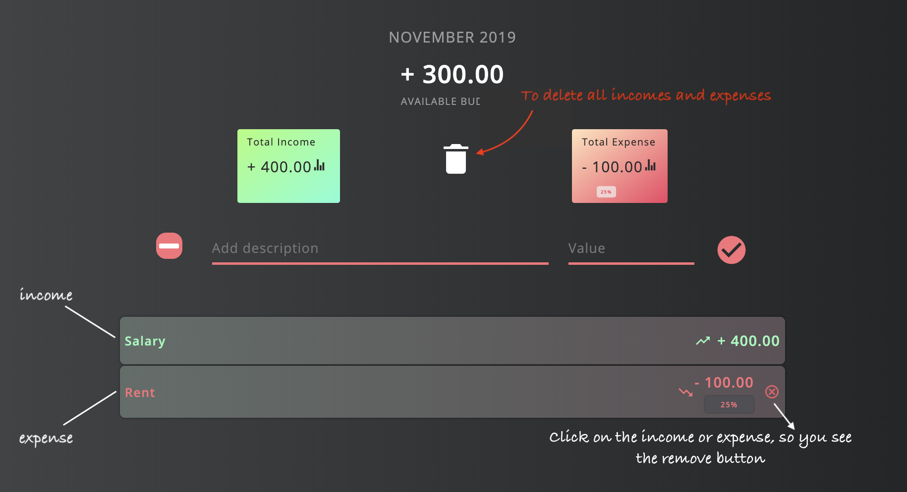

# Budgety

This is a Project inspired from Javascript course by Jonas in Udemy

- Re-designed it
- Added local storage options to delete add and update the dat in local storage
- Added a button to clear entire data at once from localstorage and UI

check it here: https://thewebdevworld.github.io/Budgety/

Instructions:

